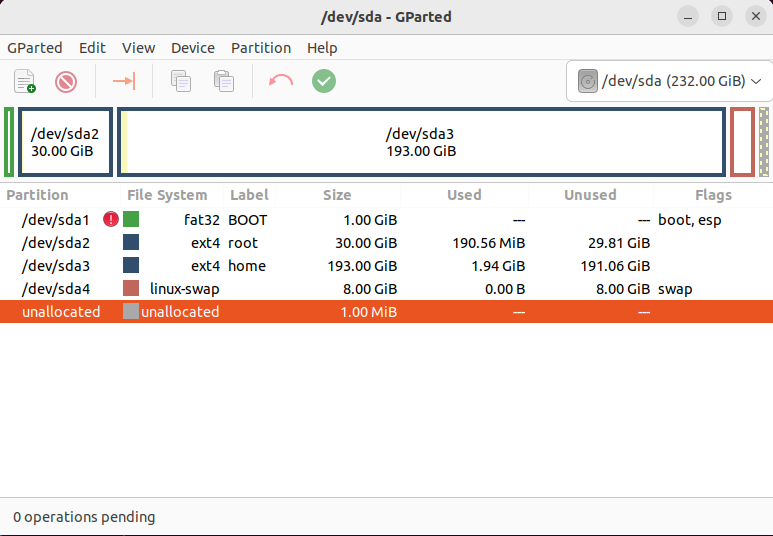
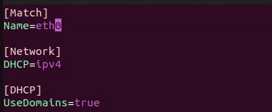

# copperOS

This is my personal take on Linux From Scratch.
This is based on version 11.2 (systemd) of LFS.

- [copperOS](#copperos)
  - [Host System](#host-system)
    - [Setting up the VM](#setting-up-the-vm)
    - [System Restart](#system-restart)
  - [Notes](#notes)
    - [Chapter 1 - Introduction](#chapter-1---introduction)
    - [Chapter 2 - Preparing the Host System](#chapter-2---preparing-the-host-system)
      - [Chapter 2.2 - Host System Requirements](#chapter-22---host-system-requirements)
      - [Chapter 2.4 - Filesystem](#chapter-24---filesystem)
      - [Chapter 2.6 - Setting The $LFS Variable](#chapter-26---setting-the-lfs-variable)
      - [Chapter 2.7 - Mounting the New Partition](#chapter-27---mounting-the-new-partition)
    - [Chapter 3](#chapter-3)
    - [Chapter 4](#chapter-4)
    - [Chapter 5](#chapter-5)
      - [Chapter 5.5 - Glibc-2.36](#chapter-55---glibc-236)
    - [Chapter 6](#chapter-6)
    - [Chapter 7](#chapter-7)
      - [Chapter 7.7 - Gettext-0.21](#chapter-77---gettext-021)
    - [Chapter 8](#chapter-8)
      - [Systemd](#systemd)
    - [Chapter 9](#chapter-9)
      - [Chapter 9.2.1. Network Interface Configuration Files](#chapter-921-network-interface-configuration-files)
      - [Chapter 9.2.2. - Creating the /etc/resolv.conf File](#chapter-922---creating-the-etcresolvconf-file)
      - [Chapter 9.2.3. - Configuring the system hostname](#chapter-923---configuring-the-system-hostname)
      - [Chapter 9.2.4. Customizing the /etc/hosts File](#chapter-924-customizing-the-etchosts-file)
      - [Chapter 9.7. - Configuring the System Locale](#chapter-97---configuring-the-system-locale)
      - [Chapter 9.10. - Systemd Usage and Configuration](#chapter-910---systemd-usage-and-configuration)
    - [Chapter 10](#chapter-10)
      - [Chapter 10.3. - Linux-5.19.2](#chapter-103---linux-5192)
    - [Chapter 11](#chapter-11)
  - [Useful Links and Remarks](#useful-links-and-remarks)
  - [Acknowledgement](#acknowledgement)

## Host System

The Host System is Ubuntu 22.04.1 (other distros should work) running as a Virtual Machine in Hyper-V.
xRDP is used to log into the VM to have Hyper-Vs enhanced session supported.

### Setting up the VM

Create a new VM in Hyper-V.

- Generation 2
- Disable dynamically managed RAM
- Network default switch
- (Adjust amount of CPU cores)

Before starting the VM make sure to change the safe start settings from windows to UEFI certified. Disable safe start as well.

**!!! Make absolutely sure not to check the box for auto login !!!**

Once Install is complete run this script to install xRDP.

``` sh
wget https://raw.githubusercontent.com/Hinara/linux-vm-tools/ubuntu20-04/ubuntu/22.04/install.sh
sudo chmod +x install.sh
sudo ./install.sh
```

If you still don't get the prompt to set the resolution when connecting to the VM, run this on the Host machine.

``` pwsh
Set-VM -VMName <your_vm_name> -EnhancedSessionTransportType HvSocket
```

Restart both, the VM and the Host.

### System Restart

When restarting the Host there are a few things to take care of.

**Make sure the lfs variable is set:**

``` sh
echo $LFS
```

This should resolve to /mnt/lfs. If not run this again:

``` sh
export LFS=/mnt/lfs
```

## Notes

### Chapter 1 - Introduction

Nothing to note here.

### Chapter 2 - Preparing the Host System

#### Chapter 2.2 - Host System Requirements

Command to change from dash to bash and make /bin/sh a symbolic hard link to bash.

``` sh
dpkg-reconfigure dash
```

A prompt will popup -> click 'NO'.

Command to install the required software on the Host System.

``` sh
apt install m4 gawk bison flex automake autoconf build-essential texinfo gparted libncurses5-dev libncursesw5-dev libtool
```

Run this test script from the lfs tutorial. (this will make sure all software is installed and checks for symbolic links as well.)

``` sh
cat > version-check.sh << "EOF"
#!/bin/bash
# Simple script to list version numbers of critical development tools
export LC_ALL=C
bash --version | head -n1 | cut -d" " -f2-4
MYSH=$(readlink -f /bin/sh)
echo "/bin/sh -> $MYSH"
echo $MYSH | grep -q bash || echo "ERROR: /bin/sh does not point to bash"
unset MYSH

echo -n "Binutils: "; ld --version | head -n1 | cut -d" " -f3-
bison --version | head -n1

if [ -h /usr/bin/yacc ]; then
  echo "/usr/bin/yacc -> `readlink -f /usr/bin/yacc`";
elif [ -x /usr/bin/yacc ]; then
  echo yacc is `/usr/bin/yacc --version | head -n1`
else
  echo "yacc not found"
fi

echo -n "Coreutils: "; chown --version | head -n1 | cut -d")" -f2
diff --version | head -n1
find --version | head -n1
gawk --version | head -n1

if [ -h /usr/bin/awk ]; then
  echo "/usr/bin/awk -> `readlink -f /usr/bin/awk`";
elif [ -x /usr/bin/awk ]; then
  echo awk is `/usr/bin/awk --version | head -n1`
else
  echo "awk not found"
fi

gcc --version | head -n1
g++ --version | head -n1
grep --version | head -n1
gzip --version | head -n1
cat /proc/version
m4 --version | head -n1
make --version | head -n1
patch --version | head -n1
echo Perl `perl -V:version`
python3 --version
sed --version | head -n1
tar --version | head -n1
makeinfo --version | head -n1  # texinfo version
xz --version | head -n1

echo 'int main(){}' > dummy.c && g++ -o dummy dummy.c
if [ -x dummy ]
  then echo "g++ compilation OK";
  else echo "g++ compilation failed"; fi
rm -f dummy.c dummy
EOF

bash version-check.sh
```

#### Chapter 2.4 - Filesystem

These are the partitions that have been created for the LFS System. They are on a separate disk from the Host system. I added the home partition because I plan on doing BLFS as well.

In order to be able to create a new partition in gparted, add a new .vhdx disc in HyperV to the Linux VM.

Partition it in GParted like this:



#### Chapter 2.6 - Setting The $LFS Variable

Make sure to to this as user and as root.

``` sh
export LFS=/mnt/lfs
```

#### Chapter 2.7 - Mounting the New Partition

Run theses two commands.

``` sh
mkdir -pv $LFS
mount -v -t ext4 /dev/sdb2 $LFS
mkdir -v $LFS/home
mount -v -t ext4 /dev/sdb3 $LFS/home
```

``` sh
/sbin/swapon -v /dev/sdb4
```

### Chapter 3

Before downloading all the packages with the following command cd into $LFS/sources.

``` sh
wget https://www.linuxfromscratch.org/lfs/view/stable-systemd/wget-list-systemd
```

Also get the md5sum.

``` sh
wget https://www.linuxfromscratch.org/lfs/view/stable-systemd/md5sums
```

### Chapter 4

For the compiling and building of the packages for LFS to be as quick as possible modify the bashrc file as lfs user and add 'MAKEFLAGS='-j6''. This example is for 6 CPU Cores that are allocated to the VM.

Don't forget to add 'MAKEFLAGS' to the export list of this file.

``` sh
nano ~/.bashrc
```

The final file should like this:


### Chapter 5

We are compiling the packages in this chapter. Follow the instructions from the book but untar before and remove at the end for each package with these commands.

This is an example for the 'binutils' package. Run these one after the other, one block at a time.

``` sh
tar -xf binutils-2.39.tar.xz

cd binutils-2.39.tar.xz

mkdir -v build
cd       build

../configure --prefix=$LFS/tools \
             --with-sysroot=$LFS \
             --target=$LFS_TGT   \
             --disable-nls       \
             --enable-gprofng=no \
             --disable-werror

make

make install

cd ../..

rm -rf binutils-2.39
```

#### Chapter 5.5 - Glibc-2.36

To prevent compiling errors run:

``` sh
make -j1
```

Do this whenever the book states that multicore compiling could lead to errors.

### Chapter 6

Nothing to note here.

### Chapter 7

For this chapters builds the same structure as explained in [Chapter 5](#chapter-5) applies.

#### Chapter 7.7 - Gettext-0.21

Before starting building and installing again, run:

``` sh
export MAKEFLAGS=-j6
```

This again makes sure we are using all our cores. Do this also whenever a Host restart happened.

### Chapter 8

For this chapters builds the same structure as explained in [Chapter 5](#chapter-5) applies.

#### Systemd

Maybe this will be a problem later if I decide to include a package manager.
*systemctl disable systemd-sysupdate*

### Chapter 9

#### Chapter 9.2.1. Network Interface Configuration Files

The system is configured for DHCP setup.



#### Chapter 9.2.2. - Creating the /etc/resolv.conf File

Creating the /etc/resolv.conf file skipped for now. (Should be created on its own later)

#### Chapter 9.2.3. - Configuring the system hostname

Run this:

``` sh
echo "copper" > /etc/hostname
```

#### Chapter 9.2.4. Customizing the /etc/hosts File

Make /etc/hosts file look like this:

``` vim
# Begin /etc/hosts

127.0.0.1 localhost.localdomain localhost
127.0.1.1 copper.copperOS.com copper

::1       localhost ip6-localhost ip6-loopback
ff02::1   ip6-allnodes
ff02::2   ip6-allrouters

# End /etc/hosts
```

#### Chapter 9.7. - Configuring the System Locale

The locale is configured for en_US. Run this command to set this up:

``` vim
LC_ALL=en_US.ISO-8859-1 locale language
LC_ALL=en_US.ISO-8859-1 locale charmap
LC_ALL=en_US.ISO-8859-1 locale int_curr_symbol
LC_ALL=en_US.ISO-8859-1 locale int_prefix
```

Then create the locale.conf

``` vim
cat > /etc/locale.conf << "EOF"
LANG=<ll>_<CC>.<charmap><@modifiers>
EOF
```

Vim into this file and make it look like this:


#### Chapter 9.10. - Systemd Usage and Configuration

Disabled screen clearing on boot.

Configuration file for core dumps created.

### Chapter 10

#### Chapter 10.3. - Linux-5.19.2

For this sections again use the methods described in [Chapter 5](#chapter-5).

Don't forget to adjust the kernel configuration if the Host is using UEFI.

**!!! DO NOT DELETE THE /sources/linux-5.19.2 FOLDER YET !!!**

### Chapter 11

Nothing to note here.

## Useful Links and Remarks

[xRDP enhanced session](https://github.com/Hinara/linux-vm-tools).

## Acknowledgement

This is based on the awesome book [Linux From Scratch](https://www.linuxfromscratch.org/index.html)
